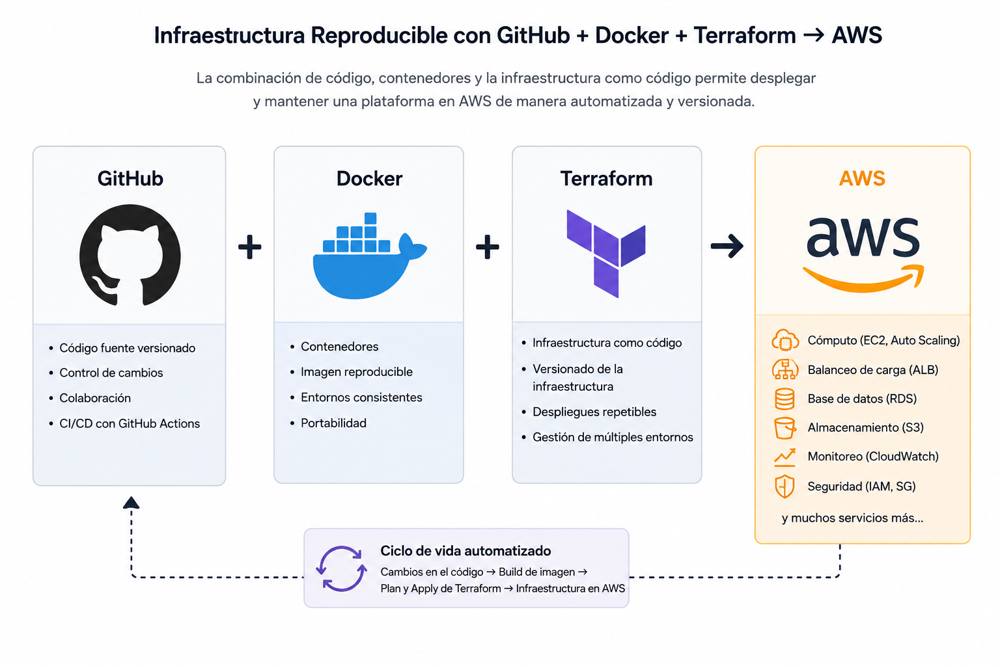
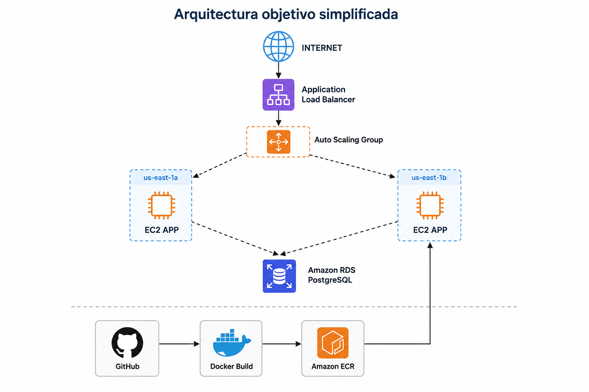
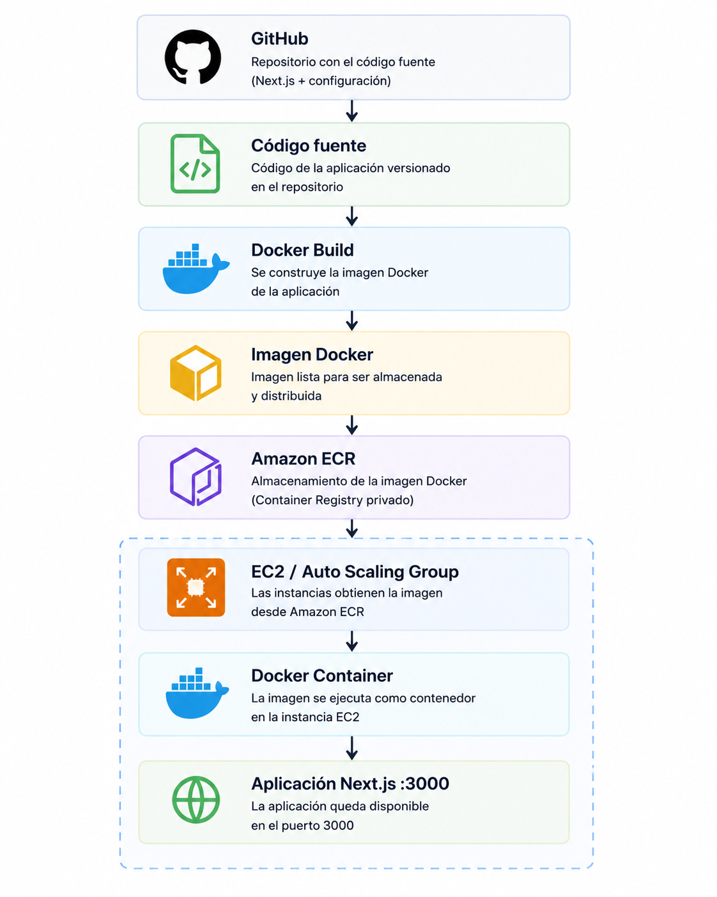
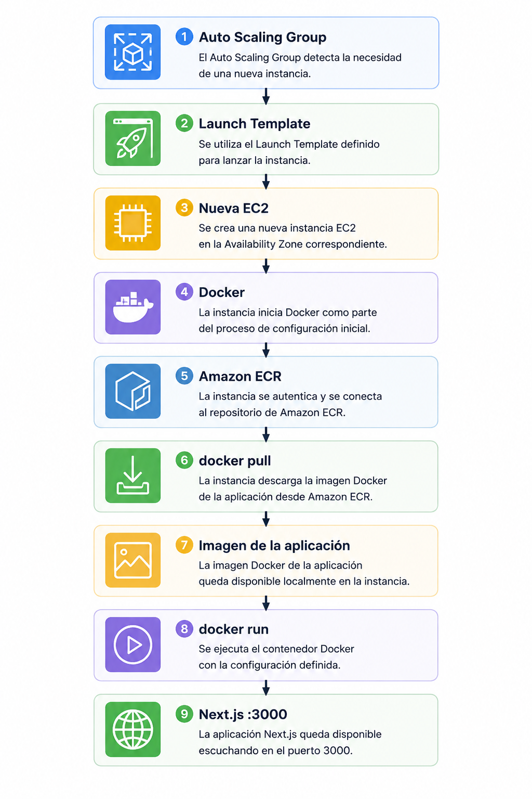
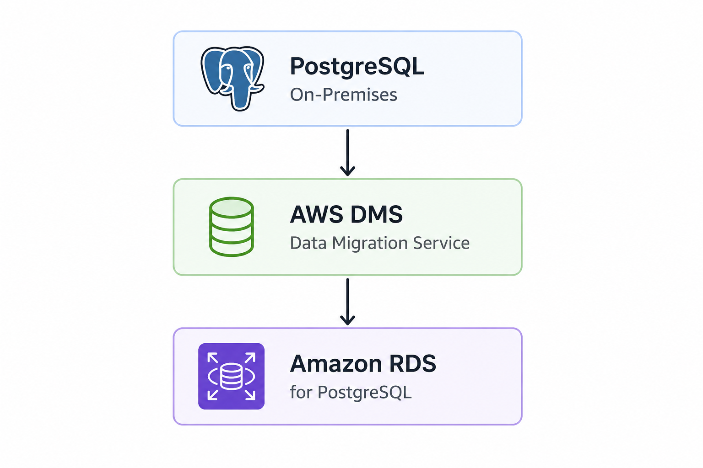
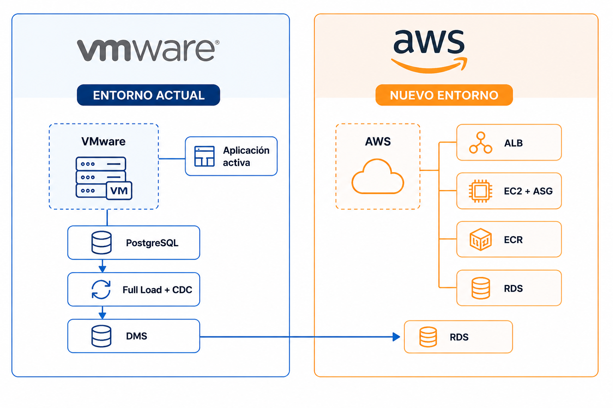
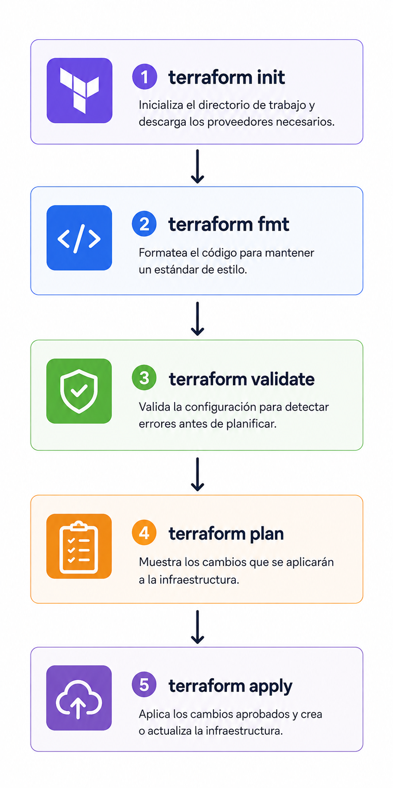

# Estrategia de Migración de VMware a AWS

## 1. Objetivo

El objetivo de esta fase es definir la estrategia utilizada para migrar y modernizar la plataforma desde el entorno VMware on-premises hacia Amazon Web Services (AWS).

La migración no se plantea como una copia directa de las máquinas virtuales existentes, sino como una modernización progresiva de la arquitectura, reemplazando determinados componentes administrados manualmente por servicios nativos y administrados de AWS.

Los principales objetivos son:

- Reducir la dependencia de servidores configurados manualmente.
- Implementar infraestructura reproducible mediante Infrastructure as Code (IaC).
- Mejorar la disponibilidad mediante una arquitectura Multi-AZ.
- Separar las capas pública, aplicación y base de datos.
- Incorporar escalabilidad automática.
- Centralizar las imágenes Docker mediante Amazon ECR.
- Migrar PostgreSQL hacia un servicio administrado.
- Minimizar la interrupción del servicio durante una eventual migración productiva.
- Establecer una arquitectura preparada para automatización, observabilidad y CI/CD.

---

## 2. Entorno de origen

La plataforma inicial fue implementada sobre VMware y está compuesta por diferentes máquinas virtuales responsables de las principales capas de la aplicación.

| Componente | Función |
|---|---|
| `DM-WEB-01` | Nginx / capa web y Reverse Proxy |
| `DM-API-01` | Aplicación Next.js ejecutada mediante Docker |
| `DM-DB-01` | Base de datos PostgreSQL |
| `DM-MON-01` | Prometheus y Grafana |
| `DM-BASTION-01` | Bastion Host y GitHub Actions Self-Hosted Runner |

Este entorno permitió validar previamente:

- Funcionamiento de la aplicación.
- Comunicación entre servidores.
- Persistencia en PostgreSQL.
- Reverse Proxy con Nginx.
- Monitoreo centralizado.
- Administración mediante Bastion Host.
- Automatización mediante CI/CD.

> La implementación completa del entorno VMware se encuentra documentada en `docs/02-on-premise-implementation/`.

---

## 3. Evaluación de estrategias de migración

Antes de implementar la infraestructura AWS se evaluaron diferentes alternativas para trasladar los workloads existentes.

La estrategia de migración debe seleccionarse según las características de cada componente y no necesariamente aplicar el mismo mecanismo a toda la plataforma.

Para este proyecto se analizaron principalmente dos enfoques:

- Rehost / Lift-and-Shift.
- Replatform / Modernización.

---

## 4. Alternativa Rehost / Lift-and-Shift

Una primera alternativa consiste en trasladar las máquinas virtuales existentes hacia Amazon EC2 conservando gran parte de su sistema operativo, software instalado y configuración.

Una solución como AWS Application Migration Service (AWS MGN) puede utilizarse para replicar servidores de origen y posteriormente realizar un cutover hacia instancias EC2.

Conceptualmente:

```text
VMware
│
├── DM-WEB-01
├── DM-API-01
├── DM-DB-01
├── DM-MON-01
└── DM-BASTION-01
        │
        │ Rehost / Replicación
        ▼
AWS
│
├── EC2 WEB
├── EC2 API
├── EC2 DB
├── EC2 MON
└── EC2 BASTION
```

### Ventajas

- Menores cambios iniciales sobre la aplicación.
- Permite trasladar servidores legacy.
- Reduce la necesidad de reconstruir manualmente configuraciones complejas.
- Puede resultar apropiado cuando el software depende fuertemente del sistema operativo de origen.

### Desventajas

- Mantiene gran parte de la arquitectura tradicional.
- Conserva responsabilidades operacionales del servidor.
- No aprovecha completamente los servicios administrados de AWS.
- Puede trasladar deuda técnica hacia la nube.
- Mantiene servidores que deben seguir siendo administrados, parchados y monitoreados.

---

## 5. Alternativa Replatform / Modernización

La segunda alternativa consiste en mantener la aplicación y sus funcionalidades principales, pero modificar la plataforma sobre la cual se ejecutan sus componentes.

En este escenario no es necesario trasladar cada máquina virtual completa.

Los servicios son reconstruidos utilizando infraestructura AWS y servicios administrados.

```text
VMware / On-Premises
        │
        ▼
Evaluación de componentes
        │
        ▼
Replatform / Modernización
        │
        ▼
AWS
```

Este enfoque permite utilizar servicios como:

- Application Load Balancer.
- Amazon EC2.
- Auto Scaling.
- Amazon ECR.
- Amazon RDS.
- Amazon S3.
- Amazon CloudWatch.
- AWS IAM.
- AWS Database Migration Service.
- Infrastructure as Code mediante Terraform.
- Servicios serverless y arquitecturas event-driven.

---

## 6. Estrategia seleccionada

Para este proyecto se seleccionó principalmente una estrategia de **Replatform / Modernización**.

AWS Application Migration Service fue considerado como alternativa para realizar un rehost de las máquinas virtuales, pero no fue seleccionado como mecanismo principal debido a que los principales componentes pueden reconstruirse de manera controlada en AWS.

La aplicación dispone de:

- Código fuente versionado en GitHub.
- Dockerfile.
- Dependencias declaradas.
- Imagen Docker almacenada en Amazon ECR.
- Configuración reproducible.
- Pipeline CI/CD.
- Base de datos PostgreSQL claramente identificada.
- Infraestructura AWS administrable mediante Terraform.

Por lo tanto, no existe una necesidad técnica de conservar íntegramente el sistema operativo y disco de `DM-API-01`.

En lugar de copiar la máquina virtual completa, el servicio puede reconstruirse automáticamente sobre nuevas instancias AWS.




Esto permite evolucionar desde servidores configurados manualmente hacia infraestructura reproducible y reemplazable.

---

## 7. Mapeo de arquitectura VMware hacia AWS

La modernización definida para el proyecto contempla el siguiente mapeo:

| VMware / On-Premises | AWS objetivo | Estrategia |
|---|---|---|
| `DM-WEB-01` / Nginx | Application Load Balancer | Replatform |
| `DM-API-01` / Next.js + Docker | EC2 + Launch Template + Auto Scaling Group | Replatform |
| Imagen Docker de la aplicación | Amazon ECR | Replatform / Container Registry |
| `DM-DB-01` / PostgreSQL | Amazon RDS for PostgreSQL | Replatform |
| Datos PostgreSQL | AWS Database Migration Service | Full Load + CDC |
| `DM-MON-01` / Prometheus + Grafana | Amazon CloudWatch | Modernización |
| Configuración manual de infraestructura | Terraform | Infrastructure as Code |
| Escalamiento manual | Auto Scaling | Modernización |
| Entrada web mediante servidor Nginx | Application Load Balancer | Modernización |
| Imágenes y objetos estáticos | Amazon S3 | Replatform |
| Ejecución de contenedores | EC2 + Auto Scaling Group | Replatform |




---

## 8. Estrategia para la aplicación

La aplicación no será migrada copiando directamente el disco de la máquina virtual `DM-API-01`.

Debido a que el código fuente, las dependencias y el `Dockerfile` se encuentran versionados, la aplicación puede ser reconstruida y distribuida como una imagen Docker.

Para centralizar las imágenes de contenedores se utiliza **Amazon Elastic Container Registry (Amazon ECR)**.

El flujo definido para la aplicación es:


<p align="center">
  
</p>

Amazon ECR funciona como el registro privado de imágenes Docker de la plataforma.

En lugar de depender de que cada nueva instancia compile nuevamente el código fuente, las instancias pueden obtener una imagen Docker previamente construida y almacenada en ECR.

Este enfoque permite:

- Centralizar las imágenes Docker.
- Mantener una versión consistente de la aplicación.
- Versionar imágenes mediante tags.
- Reducir el trabajo realizado durante el arranque de una instancia.
- Integrar el proceso posteriormente con GitHub Actions.
- Facilitar despliegues automatizados.
- Permitir que nuevas instancias del Auto Scaling Group obtengan la misma imagen.
- Mejorar la reproducibilidad del entorno.

El proceso objetivo de una nueva instancia es:

<p align="center">
  
</p>

Las instancias EC2 son creadas mediante un **Launch Template** administrado por Terraform.

La configuración inicial se automatiza mediante `user_data`, evitando depender de instalaciones manuales posteriores.

Esto permite que una instancia sea reemplazada automáticamente sin depender de configuraciones realizadas manualmente en una máquina anterior.

Este modelo se aproxima a un enfoque de **infraestructura inmutable**, donde los servidores son reemplazables en lugar de reparados permanentemente mediante cambios manuales.

---

## 9. Estrategia para PostgreSQL

La base de datos requiere una estrategia diferente debido a que contiene información persistente y cambiante.

Mientras que el código de la aplicación puede reconstruirse desde GitHub y la imagen Docker almacenarse en Amazon ECR, los datos almacenados en PostgreSQL deben ser transferidos preservando su integridad.

La arquitectura objetivo utiliza:

<p align="center">
  
</p>

Para un escenario empresarial productivo se contempla utilizar:

- Full Load.
- Change Data Capture (CDC).

---

## 10. Migración inicial mediante Full Load

Durante la primera etapa de migración, AWS Database Migration Service puede realizar la carga inicial de los datos existentes desde PostgreSQL hacia Amazon RDS.

```text
PostgreSQL VMware
        │
        │ Full Load
        ▼
      AWS DMS
        │
        ▼
Amazon RDS PostgreSQL
```

Full Load permite trasladar el conjunto inicial de información mientras el entorno AWS se encuentra en preparación y validación.

Durante esta etapa, el entorno VMware puede continuar proporcionando el servicio productivo.

---

## 11. Replicación mediante Change Data Capture

Después de completar la carga inicial, la base de datos de origen puede continuar recibiendo operaciones.

AWS DMS puede capturar los cambios posteriores y replicarlos hacia Amazon RDS.

Ejemplos de operaciones:

```text
INSERT
UPDATE
DELETE
   │
   ▼
PostgreSQL origen
   │
   ▼
AWS DMS
   │
   │ CDC
   ▼
Amazon RDS PostgreSQL
```

El objetivo es mantener el destino actualizado mientras la aplicación original continúa operando.

Esto permite reducir considerablemente la cantidad de cambios pendientes antes del cutover.

---

## 12. Coexistencia de ambos entornos

En un escenario empresarial, la infraestructura AWS no debe comenzar a construirse una vez apagado VMware.

Ambos entornos deben coexistir temporalmente.

<p align="center">
  
</p>


Durante este período, VMware continúa atendiendo usuarios mientras AWS es preparado y validado.

Esto permite realizar pruebas sin afectar el entorno productivo.

---

## 13. Validaciones previas al cutover

Antes de cambiar el tráfico hacia AWS deben realizarse diferentes pruebas.

Entre ellas:

- Validación funcional de la aplicación.
- Validación de la imagen Docker almacenada en Amazon ECR.
- Health Checks del Application Load Balancer.
- Validación del Auto Scaling Group.
- Pruebas de conectividad entre aplicación y base de datos.
- Validación de datos migrados.
- Pruebas de carga.
- Validación de métricas y monitoreo.
- Pruebas de seguridad.
- Validación de reglas de Security Groups.
- Pruebas de recuperación.
- Validación del procedimiento de rollback.

El objetivo es que la infraestructura AWS sea validada antes de recibir tráfico productivo.

---

## 14. Estrategia para minimizar downtime

La migración se diseña para minimizar la ventana durante la cual los usuarios no puedan operar.

Gran parte del trabajo debe ejecutarse antes del cutover:

```text
Construcción AWS
      │
      ▼
Preparación aplicación / ECR
      │
      ▼
Migración inicial de datos
      │
      ▼
CDC activo
      │
      ▼
Pruebas AWS
      │
      ▼
Validación
      │
      ▼
CUTOVER
```

De esta forma, el trabajo pesado de infraestructura, preparación de la aplicación y transferencia de datos no ocurre dentro de la ventana de interrupción.

---

## 15. Cutover

Una vez validado el nuevo entorno AWS y reducida suficientemente la diferencia entre la base de datos de origen y destino, se puede ejecutar una ventana de cutover controlada.

Un procedimiento empresarial podría considerar:

1. Definir una ventana de migración.
2. Notificar a los responsables involucrados.
3. Restringir temporalmente nuevas escrituras en el sistema de origen.
4. Esperar la replicación de los últimos cambios mediante CDC.
5. Validar consistencia de datos entre origen y destino.
6. Configurar la aplicación AWS para operar sobre Amazon RDS.
7. Cambiar el tráfico o DNS hacia el Application Load Balancer.
8. Ejecutar pruebas funcionales.
9. Validar logs y métricas.
10. Confirmar operación normal.


## 16. Estrategia de rollback

La infraestructura VMware no debe eliminarse inmediatamente después del cutover.

Durante un período definido debe permanecer disponible como parte del plan de contingencia.

```text
AWS
 │
 │ Problema crítico
 ▼
Rollback
 │
 ▼
Entorno VMware
```

Antes del cambio productivo deben definirse:

- Criterios para considerar exitoso el cutover.
- Criterios para activar rollback.
- Responsables de la decisión.
- Tiempo máximo disponible para tomar la decisión.
- Procedimiento de recuperación.
- Estrategia de reconciliación de datos.
- Procedimiento para restaurar tráfico hacia el entorno anterior.

La infraestructura VMware solamente debe retirarse una vez validada completamente la nueva plataforma AWS.

---

## 17. Infrastructure as Code

La nueva infraestructura AWS será administrada mediante **Terraform**.


<p align="center">
  
</p>

En lugar de crear cada recurso manualmente desde AWS Management Console, la arquitectura será declarada como código.

Terraform permite administrar recursos como:

- VPC.
- Subnets.
- Internet Gateway.
- NAT Gateway.
- Route Tables.
- Security Groups.
- Launch Templates.
- Auto Scaling Groups.
- Application Load Balancer.
- Amazon RDS.
- IAM.
- Otros servicios incorporados posteriormente.

---

## 18. Beneficios de Infrastructure as Code

El uso de Terraform permite:

- Versionar la infraestructura mediante Git.
- Revisar cambios antes de aplicarlos.
- Reproducir ambientes.
- Reducir tareas manuales.
- Disminuir errores de configuración.
- Mantener trazabilidad.
- Automatizar despliegues.
- Facilitar recuperación ante fallos.
- Integrar infraestructura con procesos DevOps.

El ciclo utilizado en el proyecto es:

<p align="center">
  
</p>

La implementación detallada de Terraform se documenta en la siguiente fase del proyecto.

---

## 19. Arquitectura objetivo de migración

La arquitectura separa dos responsabilidades:

```text
APLICACIÓN

GitHub
   ↓
Docker Build
   ↓
Amazon ECR
   ↓
EC2 / Auto Scaling


INFRAESTRUCTURA

Terraform
   ↓
AWS Provider
   ↓
VPC + Networking + Security
   ↓
ALB + ASG + EC2 + RDS
```

Esta separación permite administrar de forma independiente el ciclo de vida del código de aplicación y el ciclo de vida de la infraestructura.

---

## 20. Resultado de la fase

La fase de estrategia permitió determinar que la migración no será tratada como un simple traslado de máquinas virtuales hacia Amazon EC2.

Se definió una arquitectura objetivo basada principalmente en **Replatform y Modernización**, utilizando servicios AWS para desacoplar responsabilidades anteriormente implementadas directamente sobre servidores VMware.

La estrategia definida contempla:

- Evaluación de AWS MGN como alternativa de Rehost.
- Reconstrucción automatizada de la aplicación.
- Contenerización mediante Docker.
- Almacenamiento centralizado de imágenes Docker mediante Amazon ECR.
- Infraestructura AWS administrada mediante Terraform.
- Arquitectura Multi-AZ.
- Balanceo de carga.
- Auto Scaling.
- Migración de PostgreSQL hacia Amazon RDS.
- AWS DMS para migración de datos.
- Full Load.
- Change Data Capture.
- Coexistencia temporal VMware/AWS.
- Cutover controlado.
- Estrategia de rollback.
- Modernización progresiva de monitoreo, almacenamiento y procesamiento.

La siguiente fase del proyecto corresponde a la **implementación de la infraestructura AWS mediante Terraform**.

---

#